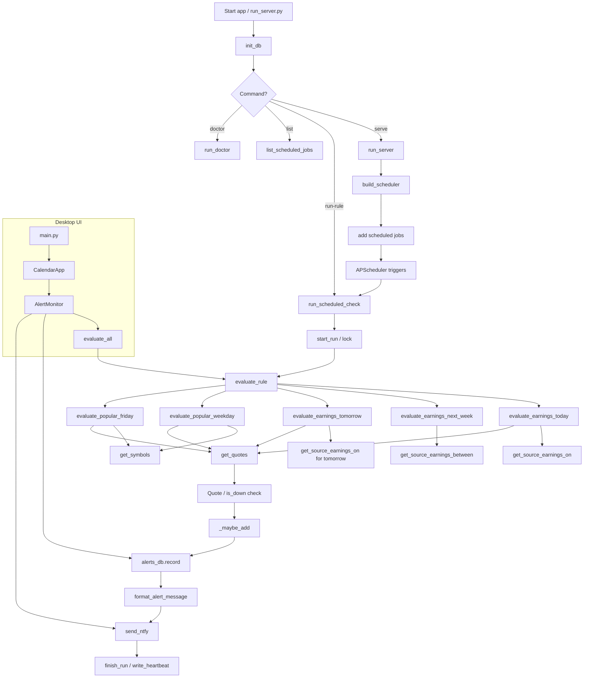

# Ticker Calendar Service Flow

```mermaid
flowchart TD
    A[Start app / run_server.py] --> B[init_db]
    B --> C{Command?}

    C -->|serve| D[run_server]
    C -->|run-rule| E[run_scheduled_check]
    C -->|list| F[list_scheduled_jobs]
    C -->|doctor| G[run_doctor]

    D --> H[build_scheduler]
    H --> I[add scheduled jobs]
    I --> J[APScheduler triggers]
    J --> E

    E --> K[start_run / lock]
    K --> L[evaluate_rule]
    L --> M[evaluate_earnings_today]
    L --> N[evaluate_earnings_next_week]
    L --> O[evaluate_earnings_tomorrow]
    L --> P[evaluate_popular_weekday]
    L --> Q[evaluate_popular_friday]

    M --> R[get_source_earnings_on]
    N --> S[get_source_earnings_between]
    O --> T[get_source_earnings_on for tomorrow]
    P --> U[get_symbols]
    Q --> U

    M --> V[get_quotes]
    O --> V
    P --> V
    Q --> V

    V --> W[Quote / is_down check]
    W --> X[_maybe_add]
    X --> Y[alerts_db.record]
    Y --> Z[format_alert_message]
    Z --> AA[send_ntfy]
    AA --> AB[finish_run / write_heartbeat]

    subgraph Desktop UI
        AC[main.py]
        AD[CalendarApp]
        AE[AlertMonitor]
        AF[evaluate_all]
    end

    AC --> AD
    AD --> AE
    AE --> AF
    AF --> L
    AE --> Y
    AE --> AA
```
